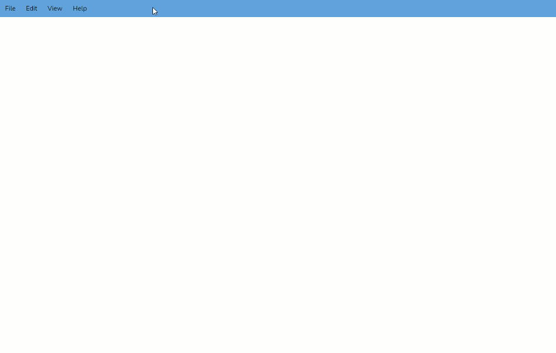

## What is vue-dock-menu

`vue-dock-menu` is a smart menubar that comes with docking super powers. The menubar can be easily docked to any four sides of the screen by drag and drop.
The menubar also transforms into a nice sidebar while docking to the left or right side of the screen.

## Features

- 🤏&nbsp;Dock the Menubar by dragging and dropping to the edges of the screen.
- 👆&nbsp;Touch support.
- 👍&nbsp;Support for nested menus up to any levels.
- 👓&nbsp;The Menus adjust to any docked position and enables an intuitive menu navigation.
- ⌨&nbsp;Keyboard Accessible.
- 🎨&nbsp;Icon support.
- ⚡&nbsp;Zero dependencies.
- 💪&nbsp;Built with Typescript.
- 🧰&nbsp;Intuitive API with data driven behavior.
- 🌠&nbsp;Built with the all new Vue 3.

## Installation

You can use either `npm` or `yarn` to install the package.

```sh
yarn install vue-dock-menu
```

```sh
npm install vue-dock-menu
```

## Demo

